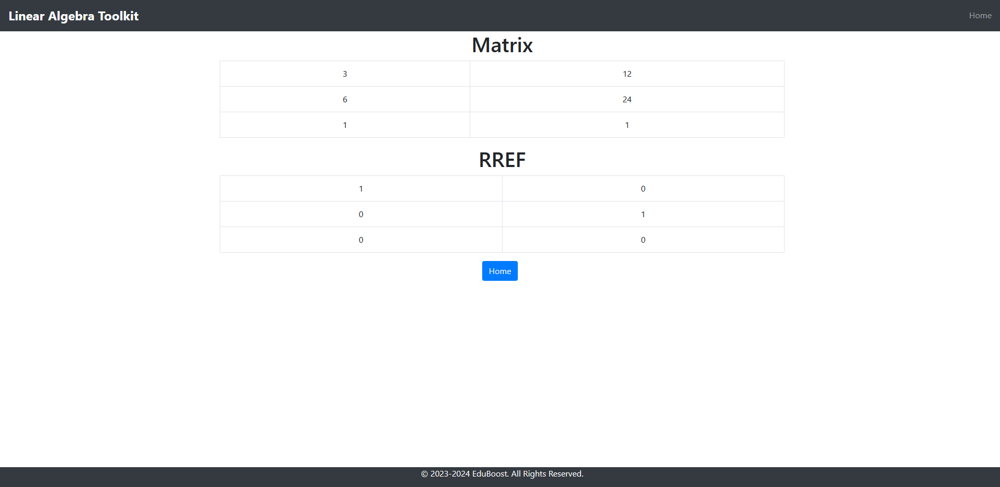
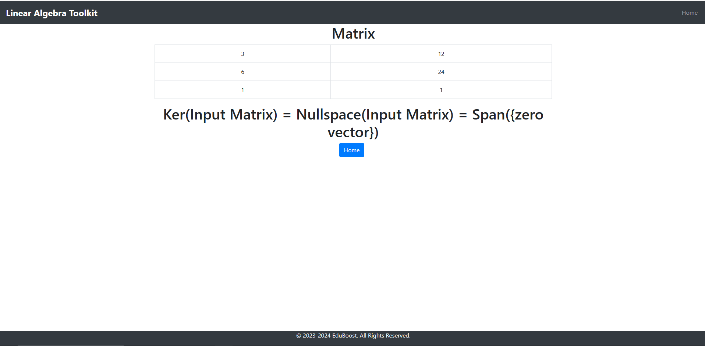
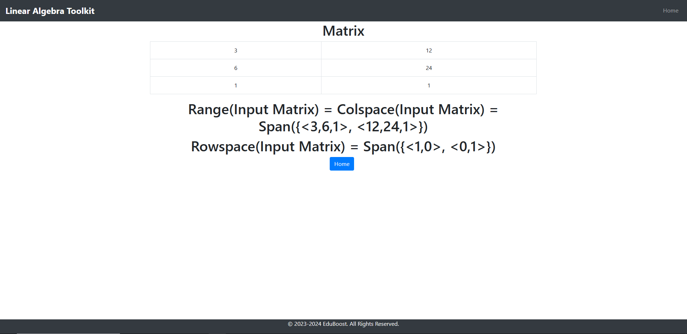

# Linear Algebra Toolkit
A website to perform common linear algebra operations including inputing matrix, finding rref, finding colspace and rowspace, and finding nullspace, TBA. This project utilizes python sympy library to perform complex linear algebra computation and send back the calculated data back to the front page. This project right now has a problem where the users will share all of the input matrix, this will be fix by associating users with input matrices later.

## Demo
* Homepage

* RREF

* Nullspace

* Colspace and Rowspace

## General Design Flow:
https://docs.google.com/document/d/151UgRyzX1GIQnWgQZXjd5QYPJwO0W-ZCCpm5zK5xot8/edit?usp=sharing

## System Setup
To run this project run the command 'pip install -r requirements.txt'
